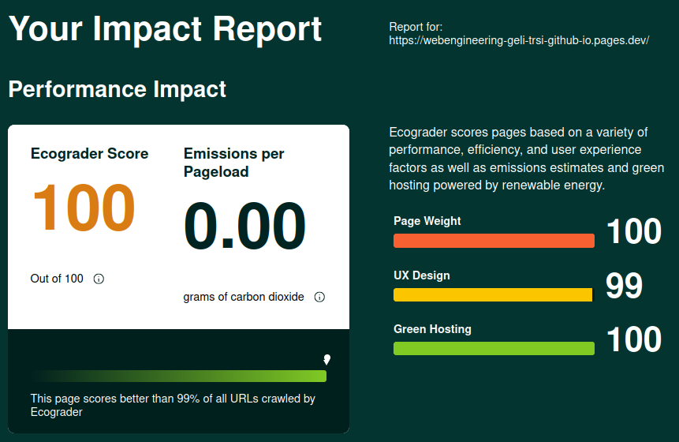

<!--more-->

## Aufgabenstellung:

Ausgefüllte Links auf HTML und CSS Validatoren, so dass die Analyse per Click gemacht werden kann. Screenshot der Ecograder Analyse. Kurze Übersicht über das Projekt und die Variantenentscheide.

## Links für Validatoren:

- [W3C HTML Validator](https://validator.w3.org/nu/?doc=https%3A%2F%2Fwebengineering-geli-trsi-github-io.pages.dev%2F)
- [W3C CSS Validator](https://jigsaw.w3.org/css-validator/validator?uri=https%3A%2F%2Fwebengineering-geli-trsi-github-io.pages.dev%2F&profile=css3svg&usermedium=all&warning=1&vextwarning=&lang=en)
- [Ecograder](https://ecograder.com/report/RwOFXJnHVidxaAG2t7BxHGTh)

### Ecograder Resultat:

#### Kurze Projektübersicht:

1. Erstellung einer einfachen HTML-Grundstruktur und ein CSS-Layout, das barrierefrei ist.
2. Gestalte ein ansprechendes Layout, das Selektoren, Einheiten, Farben, Schriften und Flex/Grid beinhaltet.
3. Es wurden geeignete Meta-Tags gesetzt.
4. Es wurde der Static Site Generator: Hugo implementiert, der aus Markdown-Files eine Webseite rendert.
5. Danach wurde die Webseite auf Cloudflare deployed, sodass direkt aus dem GIT deployed werden kann.
6. Zum Abschluss wurde der HTML und CSS Code validiert und die Webpage durch den Ecograder bewertet.

Im Post **[StaticSiteGenerator](../staticsitegenerator)** wird unsere SSG-Lösung vorgestellt und gezeigt, anhand welchen Kriterien "HUGO" gewählt wurde.

Im Post **[Deployment](../deployment)** wird erläutert, wie das Deployment gemacht wurde und wieso Cloudflare gewählt wurde.

### Deploy on Cloudflare

[PDF](cloudflare_deployment.pdf)
